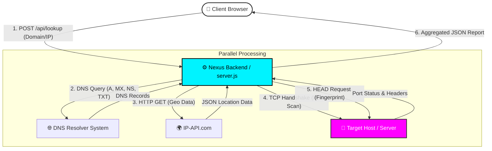

# 🌐 NEXUS | Network Intelligence Tool

[](https://nexus-tool.19062002.xyz)


**🔗 Live Demo:** [https://nexus-tool.19062002.xyz](https://nexus-tool.19062002.xyz)

---

**NEXUS** is a full-stack OSINT (Open Source Intelligence) tool designed to perform deep analysis on IP addresses and domain names. It features a "Cyber Command Centre" interface with a responsive, sci-fi aesthetic, powered by a robust Node.js backend that aggregates DNS, Geo-location, Port Scanning, and Server fingerprinting data in real-time.

---

## ✨ Key Features

### 🔍 Intelligence Capabilities
* **Client IP Detection:** Automatically identifies and displays the visitor's public IP address upon connection.
* **IP & Domain Resolution:** Instantly resolves Hostnames to IPs and performs Reverse DNS lookups.
* **Geo-Location Tracking:** Pinpoints physical location (Country, City, Coordinates) and ISP details.
* **Live Port Scanning:** Checks for open TCP ports (**21**-FTP, **22**-SSH, **80**-HTTP, **443**-HTTPS, **3306**-SQL, **8080**-ALT) to identify active services.
* **Deep DNS Analysis:** Fetches complex records including **MX** (Mail Exchange), **NS** (Name Servers), and **TXT** (Verification/SPF).
* **Server Fingerprinting:** Analyses HTTP headers to detect server software (Nginx/Apache) and technology stacks.

### 🖥️ UI/UX Experience
* **Cyber-Security Aesthetic:** Glassmorphism, neon accents, and scanning animations.
* **Interactive Visuals:** HTML5 Canvas background with particle network animations.
* **System Console:** Real-time logging of backend operations in a terminal-style output.
* **Fully Responsive:** Adaptive grid layout that scales seamlessly from Desktop to Mobile.

---

## 🛠️ Tech Stack

* **Frontend:** HTML5, CSS3 (Variables, Grid, Flexbox), Vanilla JavaScript (ES6+).
* **Backend:** Node.js, Express.js.
* **APIs & Libraries:**
    * `dns.promises` (Native Node.js DNS module).
    * `net` (Native Node.js Socket module for Port Scanning).
    * `ip-api.com` (Geo-location data).
    * `cors` (Cross-Origin Resource Sharing).
* **Deployment:** Render Cloud Hosting + Custom Subdomain (SSL Secured).

---

## 🔄 System Architecture



---

## 🚀 Getting Started

Follow these steps to run NEXUS locally.

### Prerequisites

* **Node.js** (v14 or higher)
* **npm** (Node Package Manager)

### Installation

1. **Clone the repository**
```bash
git clone [https://github.com/ppavankumar19/Nexus-Tool.git](https://github.com/ppavankumar19/Nexus-Tool.git)
cd nexus-tool

```


2. **Install Dependencies**
```bash
npm install

```


3. **Start the Server**
```bash
node server.js

```


4. **Access the Interface**
Open your browser and navigate to:
`http://localhost:5000`

---

## 📂 Project Structure

```text
nexus-tool/
├── public/              # Frontend Assets
│   └── index.html       # Single Page Application (UI + Logic)
├── server.js            # Backend Entry Point (API + Static Serving)
├── package.json         # Project Metadata & Dependencies
└── README.md            # Documentation

```

---

## 🔌 API Reference

The backend exposes powerful endpoints for network analysis.

### `GET /api/whoami`

Returns the requester's public IP address.

```json
{ "ip": "49.37.102.50" }

```

### `POST /api/lookup`

Performs a deep scan on a target.

**Request Body:**

```json
{
  "value": "google.com"  // Can be a Domain, URL, or IP Address
}

```

**Response Example:**

```json
{
  "inputType": "url",
  "hostname": "google.com",
  "ipAddresses": ["142.250.193.206"],
  "geo": {
    "country": "United States",
    "city": "Mountain View",
    "isp": "Google LLC",
    "org": "Google LLC"
  },
  "openPorts": [80, 443],
  "dns": {
    "mx": [{"exchange": "smtp.google.com", "priority": 10}],
    "ns": ["ns1.google.com"]
  },
  "http": {
    "server": "gws",
    "status": 200
  }
}

```

---

## 🤝 Contributing

Contributions are welcome! Please feel free to submit a Pull Request.

1. Fork the Project
2. Create your Feature Branch (`git checkout -b feature/AmazingFeature`)
3. Commit your Changes (`git commit -m 'Add some AmazingFeature'`)
4. Push to the Branch (`git push origin feature/AmazingFeature`)
5. Open a Pull Request

---

**Built with 💻 and ☕ by Pavan Kumar**

---
