# 🌐 NEXUS | Network Intelligence Tool

[](https://nexus-tool.19062002.xyz)


**🔗 Live Demo:** [https://nexus-tool.19062002.xyz](https://nexus-tool.19062002.xyz)

---

**NEXUS** is a full-stack OSINT (Open Source Intelligence) tool for deep analysis of IP addresses and domain names. It features an animated "Cyber Command Centre" interface with a terminal boot sequence, responsive grid layout, and a Node.js backend that aggregates DNS, Geo-location, Port Scanning, and Server fingerprinting data in real-time.

---

## ✨ Key Features

### 🔍 Intelligence Capabilities
* **Client IP Detection** — Automatically identifies the visitor's public IP on connection.
* **IP & Domain Resolution** — Resolves hostnames to IPs and performs reverse DNS lookups.
* **Geo-Location Tracking** — Country, City, ISP, ASN, Coordinates (clickable → Google Maps), and Timezone.
* **Live Port Scanning** — 16 developer-relevant TCP ports scanned in parallel (no time penalty for extra ports):

  | Port | Service | Port | Service |
  |------|---------|------|---------|
  | 21 | FTP | 3306 | MySQL |
  | 22 | SSH | 5432 | PostgreSQL |
  | 25 | SMTP | 5672 | AMQP / RabbitMQ |
  | 53 | DNS | 6379 | Redis |
  | 80 | HTTP | 8000 | HTTP-Dev |
  | 443 | HTTPS | 8080 | HTTP-Alt |
  | 3000 | Node.js | 8443 | HTTPS-Alt |
  | — | — | 9200 | Elasticsearch |
  | — | — | 27017 | MongoDB |

* **Deep DNS Analysis** — MX, NS, and TXT (SPF / DMARC / verification) records.
* **Server Fingerprinting** — HTTP status, server software, X-Powered-By, Content-Type, HSTS, and X-Frame-Options.

### 🖥️ UI / UX
* **Animated Boot Screen** — Terminal-style startup sequence with boot log and progress on every page load.
* **Structured Grid Layout** — Named CSS Grid areas: Core Metrics + Geo (row 1), Port Scan (row 2, full-width), DNS + HTTP Intel (row 3).
* **Fully Responsive** — Collapses to single-column on mobile (≤899px), touch-friendly targets.
* **Glitch Animation** — Periodic glitch effect on the NEXUS logo.
* **Particle Canvas** — Animated network background with connection lines.
* **Copy / Export JSON** — One-click copy to clipboard or download the full scan as a `.json` file.
* **Lookup History** — Last 8 scans stored in `localStorage`. Click any chip to re-scan instantly.
* **System Console** — Real-time color-coded event log.
* **Rate Limit Aware** — Shows a clear message when the rate limit is hit.

---

## 🛠️ Tech Stack

| Layer | Technology |
|-------|-----------|
| Frontend | HTML5, CSS3 (Grid, Variables, Animations), Vanilla JS (ES6+) |
| Backend | Node.js ≥18, Express v5 |
| Security | express-rate-limit (15 lookups/min, 200 global/15min) |
| DNS | `dns.promises` — native Node module |
| Port Scan | `net` — native Node TCP sockets, all parallel |
| Geo | ip-api.com free tier |
| Config | dotenv |
| Dev | nodemon |

---

## 🔄 System Architecture

```mermaid
graph TD
    Client([👤 Client Browser])
    Nexus[⚙️ Nexus Backend — server.js]
    DNS[🌐 DNS Resolver]
    Geo[🌍 ip-api.com]
    Target[🎯 Target Host]

    Client -- "POST /api/lookup" --> Nexus

    subgraph "Parallel Processing"
        Nexus -- "DNS Query (A, MX, NS, TXT)" --> DNS
        Nexus -- "HTTP GET (Geo Data)"         --> Geo
        Nexus -- "TCP × 16 Ports"              --> Target
        Nexus -- "HEAD Request (Fingerprint)"  --> Target
    end

    DNS    -- "DNS Records"       --> Nexus
    Geo    -- "JSON Location"     --> Nexus
    Target -- "Port Status"       --> Nexus
    Target -- "HTTP Headers"      --> Nexus

    Nexus -- "Aggregated JSON Report" --> Client

    style Nexus  fill:#00f3ff,stroke:#000,stroke-width:2px,color:#000
    style Client fill:#fff,stroke:#333,stroke-width:2px
    style Target fill:#ff00ff,stroke:#333,stroke-width:2px,color:#fff
```



---

## 🚀 Getting Started

### Prerequisites
* Node.js v18+
* npm

### Installation

**1. Clone the repository**
```bash
git clone https://github.com/ppavankumar19/Nexus-Tool.git
cd Nexus-Tool
```

**2. Install dependencies**
```bash
npm install
```

**3. Configure environment** *(optional)*
```bash
cp .env.example .env
# Edit .env to set PORT or other options
```

**4. Start the server**
```bash
# Production
npm start

# Development — auto-restarts on file changes
npm run dev
```

**5. Open in browser**
```
http://localhost:5000
```

---

## 📂 Project Structure

```
nexus-tool/
├── public/
│   └── index.html       # Single-page app (HTML + CSS + JS, all inline)
├── server.js            # Express API + static file server
├── package.json         # Scripts, metadata, dependencies
├── .env.example         # Environment variable template
└── README.md
```

---

## 🔌 API Reference

### `GET /api/health`
Server status — used by Render health checks, Docker, and uptime monitors.

```json
{
  "status": "ok",
  "uptime": 3600,
  "timestamp": "2026-02-27T09:00:00.000Z",
  "version": "1.0.0",
  "node": "v24.12.0"
}
```

### `GET /api/whoami`
Returns the requester's public IP address.
```json
{ "ip": "49.37.102.50" }
```

### `POST /api/lookup`
Performs a full intelligence scan. **Rate limited: 15 requests/minute per IP.**

**Request:**
```json
{ "value": "google.com" }
```

**Response:**
```json
{
  "originalInput": "google.com",
  "timestamp": "2026-02-27T09:00:00.000Z",
  "inputType": "domain",
  "hostname": "google.com",
  "ip": "142.250.193.206",
  "ipAddresses": ["142.250.193.206"],
  "protocol": "http:",
  "portsScanned": [21, 22, 25, 53, 80, 443, 3000, 3306, 5432, 5672, 6379, 8000, 8080, 8443, 9200, 27017],
  "openPorts": [
    { "port": 80,  "service": "HTTP"  },
    { "port": 443, "service": "HTTPS" }
  ],
  "geo": {
    "country": "United States", "countryCode": "US",
    "city": "Mountain View", "isp": "Google LLC",
    "org": "Google LLC", "as": "AS15169 Google LLC",
    "lat": 37.4056, "lon": -122.0775,
    "timezone": "America/Los_Angeles"
  },
  "dns": {
    "mx":  [{ "exchange": "smtp.google.com", "priority": 10 }],
    "ns":  ["ns1.google.com", "ns2.google.com"],
    "txt": ["v=spf1 include:_spf.google.com ~all"]
  },
  "http": {
    "status": 301, "statusText": "Moved Permanently",
    "server": "gws", "poweredBy": null,
    "contentType": "text/html",
    "hsts": true, "xFrameOptions": "SAMEORIGIN"
  }
}
```

**Rate-limit headers** on every response:
```
RateLimit-Limit: 15
RateLimit-Remaining: 14
RateLimit-Reset: 1740650460
```

---

## 🤝 Contributing

Contributions are welcome!

1. Fork the project
2. Create your branch — `git checkout -b feature/AmazingFeature`
3. Commit your changes — `git commit -m 'Add AmazingFeature'`
4. Push — `git push origin feature/AmazingFeature`
5. Open a Pull Request

---

**Built with 💻 and ☕ by Pavan Kumar**
